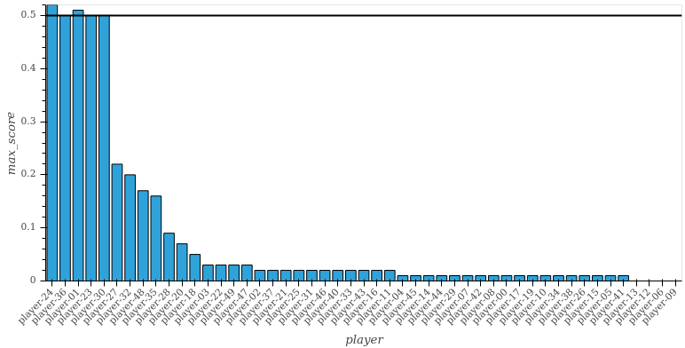
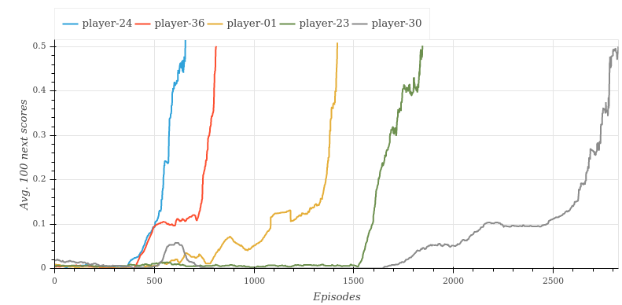

# Project Report

The Agent learns from interacting with the environment, collecting experience and using that information to find which action will take to highest rewards in different scenarios.

The main train loop is implemented by `train` function in `train.py`, taking the agent (with its hyper-parameters) as input.

## Learning Algorithm

The agent is implemented by `ddpg_agent.py`, using the [DDPG](https://arxiv.org/pdf/1509.02971.pdf) algorithm. 

It uses two neural-networks. One to decide which action to take (the actor) and another to estimate the action-value (the critic). The learning rates for them were chosen to be `1e-4` and `5e-4` respectively.

The actor:

1. take the state as input: `state:24`
2. a first hidden layer: `h1:32 = relu(fc(state))`
3. a second hidden layer: `h2:512 = relu(fc(h1))`
4. the output layer: `action:2 = tanh(fc(h2))`

The critic:

1. take the state as first input: `state:24`
2. a first hidden layer: `h1:32 = relu(fc(state))`
3. a second hidden layer with the action as additional input: `h2:512 = relu(fc(concat(h1, action)))`
4. the output layer: `value:1 = fc(h2)`

While training, the agent will collect tuples of `(state, action, reward, next_state, done)` into a structure called _replay buffer_. After every 4 frames, the agent will repeat the following logic 8 times in a row: select at random 1024 tuples out of the last 100 000 to do a update of its internal DNNs, as described by the DDPG algorithm.

To improve exploration, an Ornstein–Uhlenbeck noise is added to the actions. The scale of this noise starts at 1.0 and reduces by 1% at the end of each episode.

For increase stability, there are two copies of each network, a _local_ and a _target_ copy. Only the _local_ one is updated with gradient descent, and the learned weights are slowly copied to the _target_.

## Tuning Hyper-parameters

50 random combination of values for the hyper-parameters were tested. Each combination was trained in isolation until one of: problem is solved, or 3000 episodes executed or 120 minutes passes. From those 50 runs, only 5 were sucessful in solving the environment.

The maximum average score over 100 episodes for each experiment was:

The graph below show how this value evolved during trainig:

The best agent solved the environment in 656 episodes.

## Future Work

Maybe one way to make training more efficient (in terms of what is learnt from the episodes) is to draw positive rewards from the memory buffer with a higher probability, since at the beggining those are hard to come by and the only way for actually learning what to do.