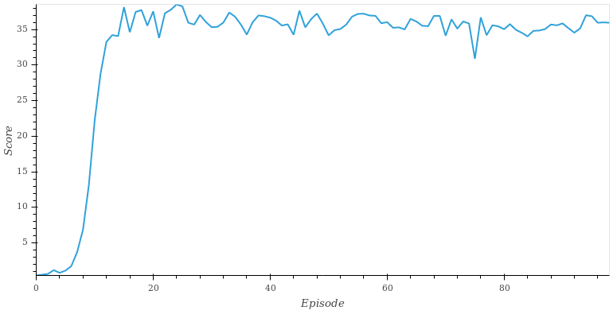

# Project Report

The Agent learns from interacting with the environment, collecting experience and using that information to find which action will take to highest rewards in different scenarios.

The main train loop is implemented by `train` function in `Continuous_Control.ipynb`, taking the agent (with its hyper-parameters) as input.

## Learning Algorithm

The agent is implemented by `ddpg_agent.py`, using the [DDPG](https://arxiv.org/pdf/1509.02971.pdf) algorithm. 

It uses two neural-networks. One to decide which action to take (the actor) and another to estimate the action-value (the critic). The learning rates for them were chosen to be `1e-3` and `1e-4` respectively.

The actor:

1. take the state as input: `state:33`
2. a first hidden layer: `h1:512 = relu(fc(state))`
3. a second hidden layer: `h2:256 = relu(fc(h1))`
4. the output layer: `action:4 = tanh(fc(h2))`

The critic:

1. take the state as first input: `state:33`
2. a first hidden layer: `h1:512 = relu(fc(state))`
3. a second hidden layer with the action as additional input: `h2:256 = relu(fc(concat(h1, action)))`
4. the output layer: `value:1 = fc(h2)`

While training, the agent will collect tuples of `(state, action, reward, next_state, done)` into a structure called _replay buffer_. After every five frames, the agent will repeat the following logic five times in a row: select at random 128 tuples out of the last 10 000 to do a update of its internal DNNs, as described by the DDPG algorithm.

To improve exploration, a gaussian noise is added to the actions. The scale of this noise starts at 0.8 and reduces by 9% at the end of each episode.

For increase stability, there are two copies of each network, a _local_ and a _target_ copy. Only the _local_ one is updated with gradient descent, and the learned weights are slowly copied to the _target_.

## Rewards

Seven scenarios were tested, by varying three hyper-parameters from a baseline.

* `baseline` with the values described above
* increasing and decreasing the hidden layers size
* increasing and decreasing the learning rate
* increasing and decreasing the initial scale of the random gaussian noise

The graph below shows the reward per episode while training for the first 30 episodes.

The graph clearly shows the impact of carefully selecting the hyperparameters of the training. In the first two graphs, the blue curve is so close to zero that we can barely see it. Over the initial baseline, increasing the noise scale from 0.8 to 1.0 seems beneficial, so that was kept.

Finally, this agent was trained to completion (average score of 30 over 100 episodes) and its weights saved as `models/final.pth`. Using this project's definition of _solved_, the agent solved the environment in 1 episode.

## Future Work

The learning seems to saturate just shy from perfect score, so there is still room for improvement. I've tried using PPO but the convergence seemed too slow, but there may lie some good improvements from the current solution.