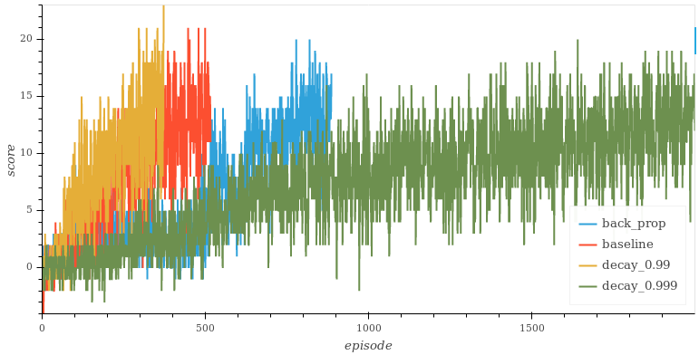
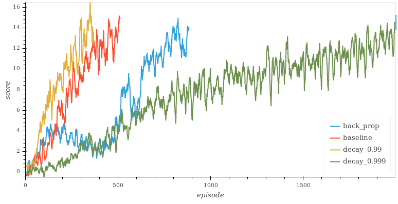

# Project Report

The Agent learns from interacting with the environment, collecting experience and using that information to find the which action will take to highest rewards in different scenarios.

The main train loop is implemented by `train_dqn.py`, taking the environment, the agent and the learning hyperparameters as input. The train loop is responsible to apply the actions choosen by agent to environment and feedback the state and reward observations.

## Learning Algorithm

The agent is implemented by `qdn_agent.py`, using the [Deep Q-Network](https://storage.googleapis.com/deepmind-media/dqn/DQNNaturePaper.pdf) algorithm. 

It uses a epsilon-greedy policy to decide which action to take each frame. This means that it will sometimes (with a probability of `epsilon`) just take some random action instead of following what it has "learned" so far. The value of epsilon starts at `1`, that is actions are totally random, and decays at the end of every episode, up to a minimum value of `0.1`. The decay rate is a hyperparameters and the values of `0.99`, `0.995` and `0.999` were tested.

When not playing at random, the agent will take the observed state (a vector of 37 floats) and pass through a neural network (DNN) with two hidden layers with 64 units and ReLu activation each, whose final output is 4 values, one for each possible discrete action. The action with the highest value is taken.

While training, the agent will collect tuples of `(state, action, reward, next_state, done)` into a structure called _replay buffer_. After every four frames, the agent will select at random 64 tuples out of the last 10 000 to do a update of its internal DNN, as described by the DQN algorithm.

A tweak to the original algorithm was tested, based on how AlphaGoZero uses its replay buffer: instead of using the reward of each step, each tuple will have the expected future reward, defined as `Rfut_n = R_n + gamma * Rfut_(n+1)`, that is, a smoothed sum of the future rewards.

## Rewards

Four scenarios were tested:

* `baseline`: epsilon decay at `0.995`
* `decay_0.99`: epsilon decay at `0.99`
* `decay_0.999`: epsilon decay at `0.999`
* `back_prop`: epsilon decay at `0.995` and using the expected future reward instead of the frame reward as described above

The graph below shows the reward per episode while training. The training stops whenever the project is solved (average of `+13` on the last 100 episodes) or at the mark of 2000 episodes.

This graph can be a little too noisy, a moving average of 10 is depicted below:

The graph clearly shows the impact of carefully selecting the hyperparameters of the training:

| Epsilon Decay | Episodes to solve |
|---------------|-------------------|
| 0.990         | 273               |
| 0.995         | 417               |
| 0.999         | >2000             |

The experiment of using expected future reward did not performed well, increasing the number of episodes needed to solve from the baseline of 417 to 787 episodes. This technique could be much more adapted for environments were the reward is only given at the end, like in Chess, Go, etc.

## Future Work

The performance of the agent can probably be improved by applied the multitude of improved techniques since the original DQN publication, like:

* Double DQN: try to cut down the overestimation of action values by using a different DNN to calculate the best action to take
* Prioritized Experience Replay: focusing frames that have more useful information from which to learn
* Dueling DQN: use a different DNN architecture that can estimate the action value based on a hidden state value

Also, other policies can be tried, like Proximal Policy Optimization.